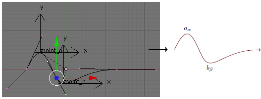
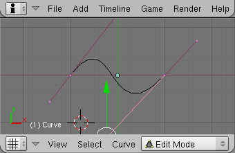
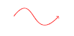
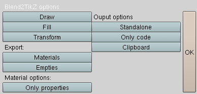
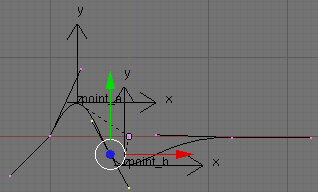
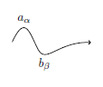
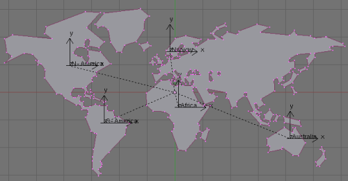
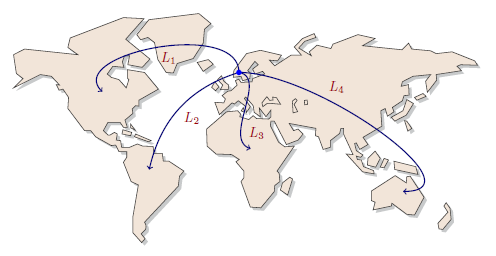

==========================
A Blender to TikZ Exporter
==========================

Export Blender curves to TikZ format for use with TeX.

:Author: Kjell Magne Fauske
:Version: 1.0
:Licence: MIT

About
=====

The ``tikz_export.py`` script is a simple tool for exporting `Blender curves`_ and empties to the TikZ format for use with TeX. `PGF and TikZ`_ is a powerful macro package for creating high quality illustrations
and graphics for use with LaTeX ConTeXt or plain TeX (examples_).

.. _examples: http://www.fauskes.net/pgftikzexamples/

Features
--------

- Exports Bézier and Poly-line curves as TikZ paths.
- Empties are exported as named coordinates.
- Material color and alpha are exported as TikZ styles and applied to paths as options.
- Custom ID and game properties can be used to pass extra options and information to TikZ.

.. note::

    TikZ is primarily a tool for drawing 2D-illustrations. The export script will therefore only export the X and Y coordinates. The Z coordinate will only be used for determining the draw order.

Requirements
------------

- Written and tested using Blender 2.45 and 2.46
- `PGF and TikZ`_ -- Graphic systems for TeX
- A full Python install is required for clipboard support on Windows. Other platforms need the standard subprocess module (requires Python 2.4 or later). Additionally:

    * Windows users need to install the PyWin32_ module.
    * Unix-like users need the xclip_ command line tool or the PyGTK_ module installed.
    * OS X users need the pbcopy_ command line tool installed.

How it works
------------

A basic example will hopefully make things clearer. Below is a simple Bezier curve drawn in the XY-plane:

Running ``tikz_export.py`` with the above curve selected will generate the code:

.. sourcecode:: latex

    \documentclass{article}
    \usepackage{tikz}
    \begin{document}
    % Materials section
    \begin{tikzpicture}
    % Curve
    \path[draw,->,thick,red] (+-1.0000,+0.0000)
    .. controls (+-0.0292,+1.2563) and (+-0.2336,+-1.3198) .. (+1.0000,+0.0000);
    \end{tikzpicture}

    \end{document}

A quick compilation with pdflatex gives a nice 2D-rendering:

.. _Blender curves: http://wiki.blender.org/index.php/Manual/Curves
.. _PGF and TikZ: http://www.ctan.org/tex-archive/help/Catalogue/entries/pgf.html
.. _PyWin32: http://pypi.python.org/pypi/pywin32/210
.. _xclip: http://sourceforge.net/project/showfiles.php?group_id=198423
.. _PyGTK: http://www.pygtk.org/
.. _pbcopy: http://developer.apple.com/documentation/Darwin/Reference/ManPages/man1/pbcopy.1.html

Usage
=====

Select the objects you want to export and invoke the script from the ``File->Export``. Alternatively you can load and run the script from inside Blender. For more information, see for instance the alienhelpdesk_ `using python scripts`_ page.

.. _alienhelpdesk: http://www.alienhelpdesk.com/home
.. _using python scripts: http://www.alienhelpdesk.com/using_python_scripts

.. note::

    For the script to appear in Blender's export menu, you have to put the file in Blender's ``scripts`` folder. Blender will then automatically detect the script upon startup.

Options
=======

When you run the export script a simple pop-up window will appear where you can set various export options:

Draw
    Apply a ``draw`` path operation to the generated path. Example output:

    .. sourcecode:: latex

        \path[draw] ...;
Fill
    Apply a ``fill`` path operation to the generated path. Example output:

    .. sourcecode:: latex

        \path[fill] ...;
Transform
    Apply scale, rotation and translation transformations. Example:

    .. sourcecode:: latex

        \path[rotate=10,scale=1.2,xshift=1.000cm,yshift=2.000cm] ...;
Materials
    When enabled, materials assigned to an object will be exported. See the Materials_ section for more details.
Empties
    Export selected empties as named coordinates. If an empty is parented to a curve the coordinate will be inserted at the end of the path:

    .. sourcecode:: latex

        \path[] .....
            (x,y) coordinate (name);
Only properties
    If a ``style`` property is assigned to a material, apply only the property value. The default behavior is to apply both material values, like color and opacity, and the custom options.
Standalone
    Create a stand-alone LaTeX file. Currently the standard template look like this:

    .. sourcecode:: latex

        \documentclass{article}
        \usepackage{tikz}
        \begin{document}
        \begin{tikzpicture}
        .. % path code
        \end{tikzpicture}
        \end{document}

Only code
    Output path commands without wrapping them in a ``tikzpicture`` environment.
Clipboard
    Put the generated code on the clipboard. Note that you need to install some external Python modules or command line tools for this to work. See the requirements_ section for details.

Exported objects
================

TikZ is primarily a tool for drawing 2D-illustrations. The export script will therefore only use the X and Y coordinates. However, the Z coordinate will be used for determining the draw order. This means that objects with the lowest Z value will be drawn first.

Curves
------

Blender has three different curve types:

*Bézier curves*. These are mapped directly to TikZ' ``Curve-To`` operation:

.. sourcecode:: latex

    \path . . . ..controls (c) and (d) .. (y) . . . ;

*Poly lines*. These are mapped directly to TikZ' ``Line-To`` operation:

.. sourcecode:: latex

    \path . . . --(coordinate) . . . ;

Poly lines are similar to meshes. Note that Blender comes bundled with a script for converting Meshes to curves.

*NURBS*. Non Uniform Rational B-Splines curves. These have no direct mapping to TikZ, and are therefore not supported. Note that you easily can covert to one of the supported curve formats using the `curve tools`_ panel.

Empties
-------

Empties can be used to place coordinates in the generated code. If an empty is parented to a curve, the coordinate will be exported as part of the path. Below is an example where two empties ``point_a`` and ``point_b`` have been parented to a curve.

Exporting the curve will generate the following path:

.. sourcecode:: latex

    \path[draw]
    (+-0.0613,+-0.3676) coordinate (point_b)
    (+-0.6536,+0.4289) coordinate (point_a)
    (+-1.0000,+0.0000)
    .. controls (+-0.6036,+0.8593) and (+-0.4711,+0.1921) .. (+-0.2369,+-0.2269)
    .. controls (+-0.0026,+-0.6460) and (+0.3468,+0.0204) .. (+1.2995,+-0.0136);

Note the two named coordinates at the start of the path. Later in the code you can reference the coordinates. Here is an example:

.. sourcecode:: latex

    \begin{tikzpicture}
    % Curve
    \path[draw,->]
    (+-0.0613,+-0.3676) coordinate (point_b)
    (+-0.6536,+0.4289) coordinate (point_a)
    (+-1.0000,+0.0000)
    .. controls (+-0.6036,+0.8593) and (+-0.4711,+0.1921) .. (+-0.2369,+-0.2269)
    .. controls (+-0.0026,+-0.6460) and (+0.3468,+0.0204) .. (+1.2995,+-0.0136);
    \node[above] at (point_a) {$a_\alpha$};
    \node[below] at (point_b) {$b_\beta$};
    \end{tikzpicture}

Materials
=========

The exporter supports a tiny subset of Blender's material properties:

- ``Col``. The diffuse color will be used as fill and/or stroke color for the curves.
- ``Alpha``. Fill and stroke opacity.

You can also add TikZ specific options using `custom properties`_.

Custom properties
=================

Blender allows saving custom data in many of the internal data types, including objects and materials. These are called ID properties. You can create and edit such properties using the ``ID Property Browser`` script found in the ``Help`` menu. Additionally you can assign game properties to objects in the `Logic panel`_.

.. _logic panel: http://wiki.blender.org/index.php/Game/Logic_Panel

You can use ID properties and game properties to specify special TikZ options.  The following properties are supported:

``style``
    A string property where the value must be valid TikZ options. The value will be applied to the path. Example::

        ->, red, very thick

    The above ``style`` value will generate the code:

    .. sourcecode:: latex

        \path[->,draw=red,very thick] ...

``preamble``
    If the current scene has the ``preamble`` property set, its value will be used in the generated document's preamble. Useful for loading libraries and such.  

The export script will look for the custom properties in the current scene, selected objects and their materials. For objects the exporter will also look in the list of game properties.

Examples
========

Annotated world map
-------------------

TikZ is a wonderful tool, but some paths and shapes can be a bit difficult and time-consuming to create manually. A typical example is a map. You could of course load a map into you illustration using ``\includegraphics``, but what if you want to easily change line and fill colors, add shadows and annotations? Blend2TikZ to the rescue.

First we need to fine a nice vector map of the world. A good place to start is a dingbat_ font. Blender can load the most common font formats. On my system I found a nice looking world map in the Webdings font:

.. figure:: img/webdings.png
   :alt: World map

Before you can use the map you have to convert it to a curve (``Alt+C``). I also recommend converting it to a poly-line curve to make the generated code more compact. After some minor editing I got something like this:

.. _dingbat:  http://en.wikipedia.org/wiki/Dingbat

Note that I have parented several empties to the map and placed them on different continents. This makes it possible to reference these coordinates later on. When you export the curve and the empties you get a very long path:

.. sourcecode:: latex

    ...
    \path[draw]
    (+0.1337,+-0.5458) coordinate (Africa)
    (+4.1679,+-1.6763) coordinate (Australia)
    (+-2.5484,+-1.1000) coordinate (S-America)
    (+-3.7897,+0.9615) coordinate (N-America)
    (+-0.1754,+1.4725) coordinate (Norway)
    (+4.7787,+0.8396)
    -- (+4.5322,+0.7372)-- (+4.4717,+0.8116)  -- (+4.6950,+0.9140)
    -- (+4.7787,+0.8396)-- cycle
    (+4.4438,+0.6489)
    -- (+4.2531,+0.3419)-- (+3.9461,+0.1837)  -- (+3.8577,+0.2861)
    -- (+4.1647,+0.4581)-- (+4.2670,+0.7558)  -- (+4.4438,+0.6489)
    -- cycle
    (+4.3973,+-0.0070)
    ....

Now to the fun part. Once we have the path we can manipulate it using TikZ' powerful syntax. The possibilities are nearly limitless. Below is one way you can use the path (`PDF version`_):

.. _PDF version: img/worldmap.pdf

.. sourcecode:: latex

    \documentclass{article}
    \usepackage{tikz}
    \usetikzlibrary{shadows}
    \begin{document}

    \begin{tikzpicture}[every node/.style={red!60!black}]
    % Worldmap
    \path[draw=black!80,thin,fill=brown!20,drop shadow]
    (+0.1337,+-0.5458) coordinate (Africa)
    (+4.1679,+-1.6763) coordinate (Australia)
    (+-2.5484,+-1.1000) coordinate (S-America)
    (+-3.7897,+0.9615) coordinate (N-America)
    (+-0.1754,+1.4725) coordinate (Norway)
    (+4.7787,+0.8396)
    -- (+4.5322,+0.7372)-- (+4.4717,+0.8116)  -- (+4.6950,+0.9140)
    -- (+4.7787,+0.8396)-- cycle
    ....
    -- (+0.6670,+0.6535)-- (+0.7538,+0.6457)  -- cycle;
    \path[->,thick,blue!50!black,auto] (Norway)
            edge[out=0,in=0]  node[pos=0.3] {$L_4$}(Australia)
            edge[out=-10,in=160] node[pos=0.9] {$L_3$} (Africa)
            edge[out=90]  node {$L_1$}(N-America)
            edge[bend right] node {$L_2$}(S-America);
    \fill[blue] (Norway) circle (2pt);
    \end{tikzpicture}
    \end{document}

Limitations
===========

- Only Beziers and poly line curves are supported. NURBS_ are not supported. You can easily convert a NURBS curve to a supported curve type in the `Curve tools`_ panel

- Blend2TikZ is not intended for exporting complicated paths with thousands of control points. In these cases it is better to load the path as an ordinary graphic using ``\includegraphics``.

.. _NURBS: http://wiki.blender.org/index.php/Manual/Curves#NURBS
.. _curve tools: http://wiki.blender.org/index.php/Reference/Panels/Editing/Curves/Curve_Tools

Tips and tricks
===============

Not a TikZ GUI
--------------

The export script is not intended as a GUI interface to TikZ. Its main purpose is to make it easy to create complicated paths for use as part of a tikzpicture. That is why there is a ``Only code`` option and clipboard support. 

File import
-----------

Blender can import SVG, PS/EPS, AI and XFIG paths. This means that you can import vector graphics from programs like Inkscape and Adobe Illustrator.

Apply scale and rotation
------------------------

If you get weird output, try applying scale and rotation (``Ctrl+A``) to the curve. 

Inkscape
--------

Inkscape_ is powerful open source vector graphics editor. Ideally I should have written an export script for Inkscape as well (the SVG XML scares me), but at the moment a workaround is to import SVG files created by Inkscape into Blender. Inkscape is useful for cleaning up curves and removing unnecessary elements. I especially recommend using the simplify_ tool to reduce the number of control points. Another useful feature is `bitmap tracing`_.

Blender's SVG importer is not very robust. If importing fails, try saving the path as simplified SVG. You should also avoid using other fill effects than plain filling. 

.. _inkscape:  http://www.inkscape.org/
.. _simplify: http://www.inkscape.org/doc/keys046.html#id2247672
.. _bitmap tracing: http://www.inkscape.org/doc/tracing/tutorial-tracing.html